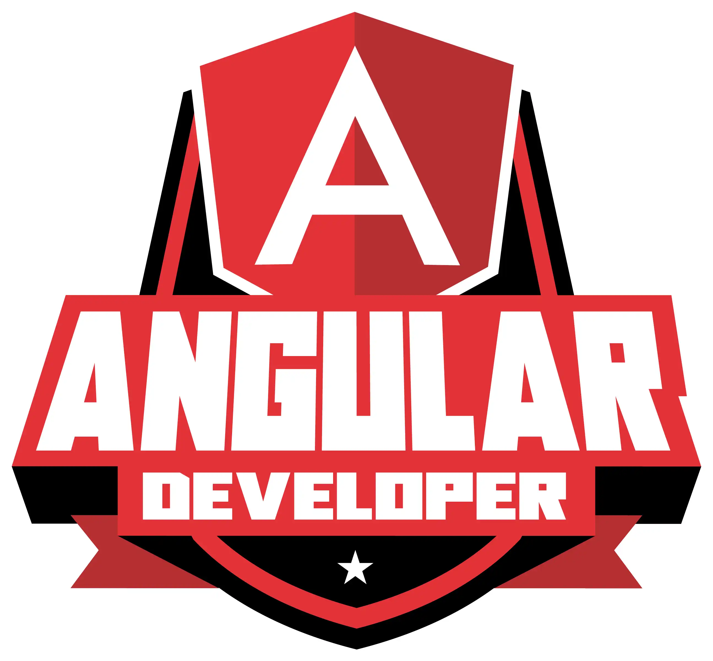

<h1 align="center">| Coding The Future - Banco Pan |</h1> 
<h2 align="center">Frontend development with Angular</h2>
<p align="center"></p>
<br>
<p align="center">
  
  
  
  
  
  
  
</p>
<br>
<hr>

<p align="center"></p>

### Tópicos 

:small_blue_diamond: [Descrição do projeto](#descrição-do-projeto)

:small_blue_diamond: [Funcionalidade](#funcionalidade)

:small_blue_diamond: [Deploy da projeto](#deploy-do-projeto-dash)

:small_blue_diamond: [Como executar](#como-executar-arrow_forward)


## Descrição do projeto 
<p> 
  Este repositório é o resultado dos meus estudos durante o bootcamp ofertado pelo banco Pan na plataforma DIO.  
  
  Aqui, você encontrará anotações detalhadas e código-fonte relacionado aos projetos desenvolvidos durante o curso.
  
</p>


<br>

<hr>

## Funcionalidade

:heavy_check_mark: Guardar projeto desenvolvido e insights adicionais do bootcamp.

<hr>

## Deploy do projeto :dash:

###   Projeto - Blog
> 
<br>

## Deploy do projeto :dash:

###   Projeto - Loja de games
> 

<br>

## Deploy do projeto :dash:

###   Projeto - Buzzfeed
>
<br>

<hr>

## Como executar :arrow_forward:

No terminal, clone o projeto: 

```
git clone https://github.com/gknpp23/
```
<br>

<br>

<hr>

Espero que este recurso seja útil para quem procura aprender mais sobre JavaScript/Typescript e Angular e acompanhar meu progresso durante o bootcamp.

<hr>

## Licença 

The [MIT License]() (MIT)

Copyright :copyright: 2022 - Formação JS DIO.

<hr>

<h2 align="center"> <em>&lt;/&gt;</em>  by <a href="https://github.com/gknpp23" target="_blank">Gabriel Knupp</a> </h2>
